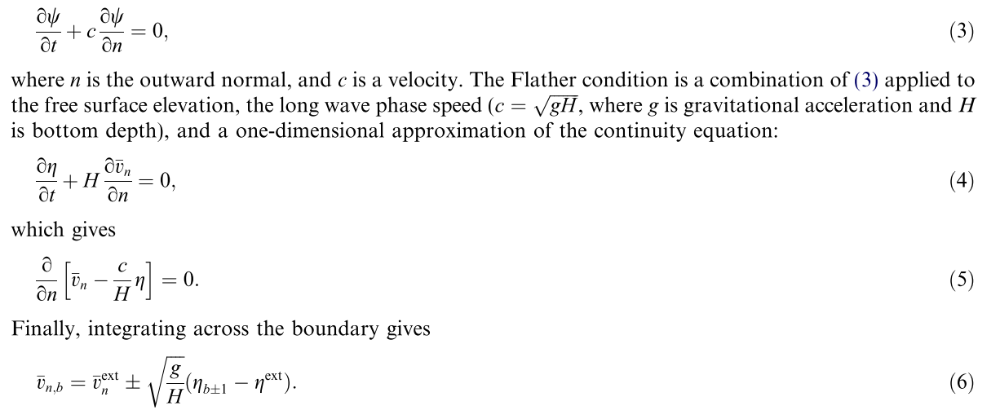
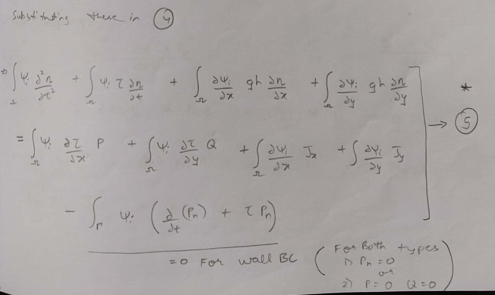
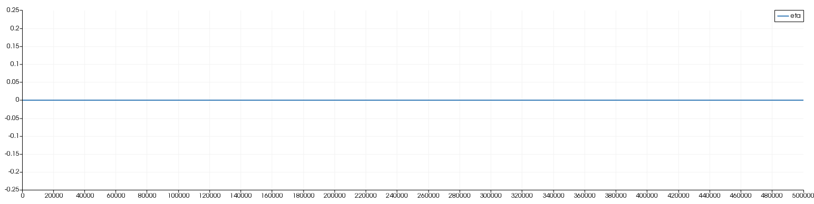
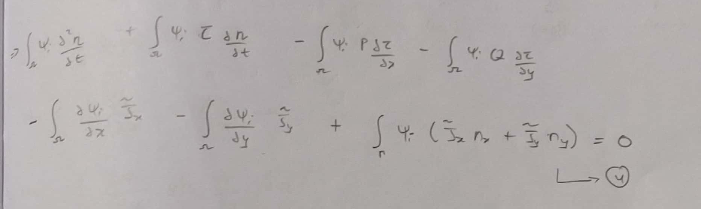
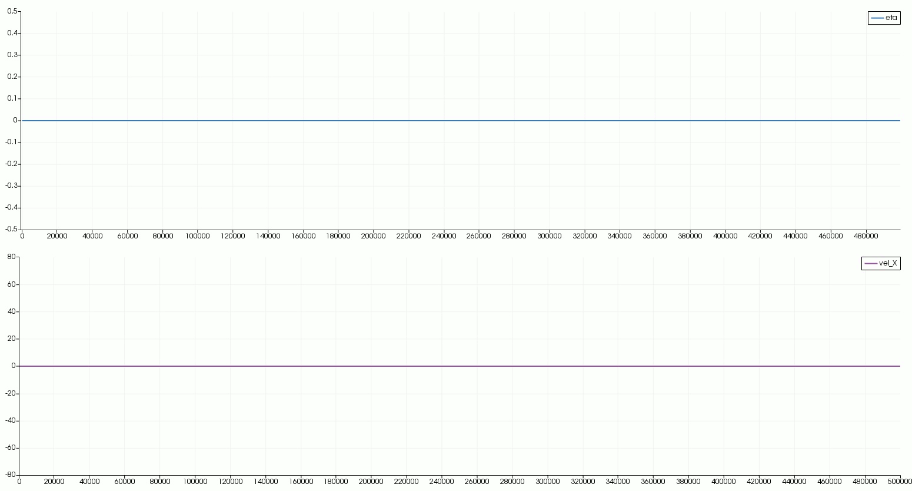
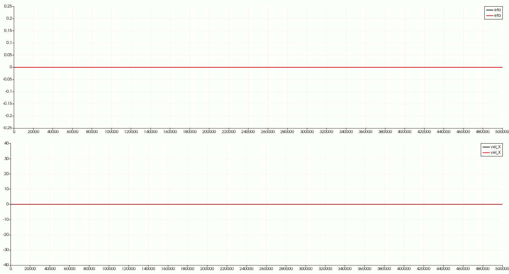
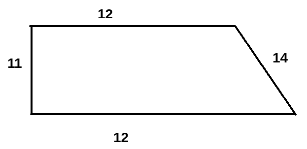

## Initial development log

1. [Feature : Removed 'global' variables in basicVars [2020-05-23]](#log_swe9n_v0001_1)
1. [Feature : Include meshFreeMod [2020-05-23]](#log_swe9n_v0001_2)
1. [Feature : Include airyWaveModule [2020-05-23]](#log_swe9n_v0001_3)
1. [Feature : Open Boundary condition [2020-05-26]](#log_swe9n_v0001_4)

### Attempting
- Clean the code
- Include meshfree module for 1st derivative

### List of Work
- [x] Removed "global" variables from basicVars
- [x] Removed rpimModule
- [x] Added meshFreeMod from Bsnq
	- [ ] Wet-dry in sweMFree
- [x] Airy wave module
- [x] Open BC - unidirectional tested
- [ ] Open BC - oblique tested
- [ ] Modify GWCErh2() as done in GPU code to check speedup

-----------------------------------------------

### Feature : Open Boundary condition [2020-05-26]

**All results presented here are there in folder 'swe-re/Analysis_OpenBC'** 

- The open boundary condition is mentioned in Carter (2007).
	- It is probably discussing a absorbing-inlet type boundary.
	- However I am first interested only in Open BC.
	- It mentions three methods
		- Clamped elevation : &eta;(b+1) = &eta;(external).  
			Apply external &eta; at point next to boundary.
		- Clamped normal velocity : pn(b) = p(external).  
			Apply external velocity at the boundary point.
		- **Flather Condition** : 
			Derived using general Sommerfield radiation BC in 1D along the edge normal, and 1D continuity equation along the edge normal. 
			 			

#### Flather Condition Trial 1 (fluke works, unstable)
- I tried this method for absorbing long waves in swe9n_v5.38 and swe9n_v5.39 with moderate success.
- Main issues were related to the boundary integral in the GWCE continuity equation. 
- The boundary integral required calculation of dP/dt at the boundary which is highly unstable. 
	- This was done using backward diff 3-point (3P(n) - 4P(n-1) + P(n-2))/2/dt. Quite unstable
	- Another approach was 2 point backward diff over 2 steps (P(n) - P(n-2))/2/dt. This was more stable than the above method.
- The method relied on knowing the value of eta at the point next to boundary point along the inward normal. 
	- It was needed to calculate the normal velocity at the boundary which is then fed to the above boundary integral in the continuity equation and also is used as Dirichlet BC for vel.
	- For a strucutred grid this was doable and in these trials I tested only in sturctured grid with the inward normal point taken to be the closest non-boundary point.
	- However for unstructured grid the easiest way would be to use meshfree.
- Average results were obtained with the simulations being stable for a very limited range of Courant numbers between 0.1 and 0.3. Hence unusable.
- The issue was that the absorbing boundary used to blow up as shown below.

- In few cases it did work ok ok, as shown below. There is minor reflection in most cases.

- But still the results were encouraging enough to pursue further for unstructured grid.

#### Flather Condition Trial 2 (doesnt work)
- I decided to use the _meshFeeMod_ from _Bsnq_ in order to calculate the derivative at the boundary and then use that to get the eta at the inward normal point.
	- It was confirmed that the derivative was calculated extremely well with the eta at inward normal being very accurate, especially for these long 'linear' waves.
- Although the boundary integral was a huge issue. I was not able to avoid the instability on the absorbing edge as seen in the previous trials.
- So I modified the boundary integral. 
	- The boundary integral is shown to be   
	- However this is the expanded form. Originally in the continuity equation.  
	- The Jx and Jy paramters are specifically calculated to avoid opening of the first time derivative of velocities, exactly the issue plaguing the boundary integral.
	- Therefore using the JXTil JyTil should solve the instability issue.
	- Another advantage is that the boundary integral will be evaluated at only one time-step t(n-1). 
		- The continuity equation is opened in time about the centre. The d2(&eta;)/dt2 is opened about t(n-1) to get &eta;(n). Therefore the boundary integral from known values of Jx(n-1) will be accurate and without need to calculate twice using different values (this was being in when the boundary integral was calculated using dP/dt, where in predictor the P(n-1) value was used and in corrector P(n, predictied) is used.)
	- Also the boundary integral could now be accurately calculated using edge normals (instead of using normal for each point which was seen to be wrong through comparison between the old and new _Bsnq_)
	- This boundary integral solved the instability issue.
- However we still did not get a open BC correct, with a long wave getting reflected back as shown below.

- **Now I dont konw if this boundary integral is required at all for the open BC to work.**
	- In the following test I applied the correct boundary values for &eta; amd P as described later on solution using simple characterstic speed method (from Reimann problem solution).
	- But I made the boundary integral = 0, as is done for a wall BC. **But still the wave got absorbed** and compares exactly with the solution where boundary integral is being calculated

	

#### Reimann Problem (works!)
- After breaking my head for 2 days with the above procedures, I noticed from one FDM paper, where the Flather method application seems very similar to solution to the Reimann problem along the characterisitc.
	- The characterstic speed is know for this wave as `c = sqrt(grav*dep)`.
	- And for Reimman problem (in 1D), the solution at F(x,t) = F(x -c &Delta;t, t-&Delta;t).
	- It seems quite obvious that atleast for the unidirection waves, what I want at the boundary is &eta;(x_boundary, t) = &eta;(x_boundary - c &Delta;t, t - &Delta;t)
	- And then P(x_boundary) = c &eta;(x_boundary, t)
	- So I just applied these two as Dirichlet BC on the open BC boundary after the predictor and the corrector steps, with the &eta;(x_boundary - c &Delta;t, t - &Delta;t) calculated along the normal using _meshFreeMod_  
		`etaEst = etat1(k) - etaDx*(dr*nx) - etaDy*(dr*ny)` 
		`dr = c*dt` 
		Here nx and ny are taken as edge normal.
	- The characterstic velocity for these long waves will always be `c = sqrt(grav*dep)`.
	- The boundary integral is still being calculated using the jxTil approach.
	- This worked winderfully well as shown in the gif above!
	- A very simple solution! and this is probably what the Falther condition too says but was written in Carter (2007) in a very confusing manne. This wasted over 3 days.
- **However it is still not certain if it will work for oblique wave**
	- When the edge normal and wave direction are not in line then I am not sure if nx and ny should be the edge normal or the wave direction.
	- If its the wave direction then where do we pick the wave direction?
	- To answer this i need to test using the following domain.

	

-----------------------------------------------

### Feature : Include airyWaveModule [2020-05-25]
- Module _airyWaveModule_ inside _modsInletBC.f90_ is added from Bsnq for tidal input.
- Will mostly be used only to calculate &eta;, as p = sqrt(gH) &eta;
- The outlet definitely requires the calculation of the boundary integral in the continuity equation (&eta; equation), which has been set to zero assuming wall BC.
	- That requires calculation of Pn and d(Pn)/dt, where Pn is the normal velocity.

-----------------------------------------------

### Feature : Include meshFreeMod [2020-05-23]
- The wave-absorption require calculation of d(&eta;)/dn.
- This is done using the _meshFreeMod_ (_modsMFree.f90_) and _findNeiFromLinkList.f90_ developed in _Bsnq_.
- Slight modifications were made as the storing system in _swe_ and _Bsnq_ are different.
- A new subroutine _sweMFree_ was written based on the subroutine _setMFree_ inside _Bsnq_ to set up the mesh free derivatives.
- **Note: For wet-dry _sweMFree_ will have to be re-run.**
	- **Note: I have not yet incorporated wet-dry in _sweMFree_**
- The calculation was **tested and verified** using simple expression `eta = 2*coorx + 3*coory`, where the x and y derivatives will be 2 and 3 respectively.
	- Could not test using Paraview because the output in Paraview is in lon-lat.
- The coef for radius is set to 0.65 => 0.65 of max distance within the directly attached neighs of the nodes.
	- For the vertex nodes it covers the near 9 nodes
	- For the edge centres it should be more than sqrt(5)/sqrt(2) of the cell side => 0.65 x max distance
	- However for the 9th nodes which is the cell centre, all the neighs are the nodes within that one lement only. Therefore radius = 0.65 x max distance will lead to a no neighs except for itself.
		- This is solved by making radius = 2 x radius if numNeigh &lt; 3.

- Also **removed _rpimModule_** which was developed in the old Bsnq code for the same purpose of interpolation and derivatives calculation and the new _meshFreeMod_ is done much better using MLS.

-----------------------------------------------

### Feature : Removed 'global' variables in basicVars [2020-05-23]
- The idea of having 'global' variables that are commonly used in subroutines, such as i, j, k, tmpr1, etc. was an idea from the older version of Bsnq development.
- However in the modular version of Bsnq I realised that this is quite a bad idea, as you might modify the variable inside a nfunction call thus messing up everything.
- Its also a bad idea when you want to run two objects of the same module (mainly a issue in Bsnq and not here).
- Hence I removed all non paramter type variables from _basicVars_.

-----------------------------------------------

## References

1. Carter, G. S., & Merrifield, M. A. (2007). Open boundary conditions for regional tidal simulations. Ocean Modelling, 18(3–4), 194–209. [Link](https://doi.org/10.1016/j.ocemod.2007.04.003)
