# Generalised Wave Continuity Equation (GWCE)

## GWCE Model Notes

| **Figure :** Notes for development of GWCE model using 9-noded quadrilateral. As per Luettich (2004) |
| :-------------: |
| 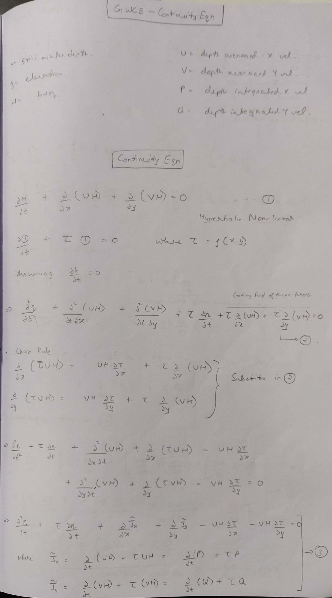 |
| 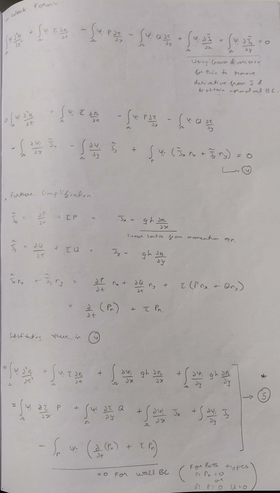 |
| 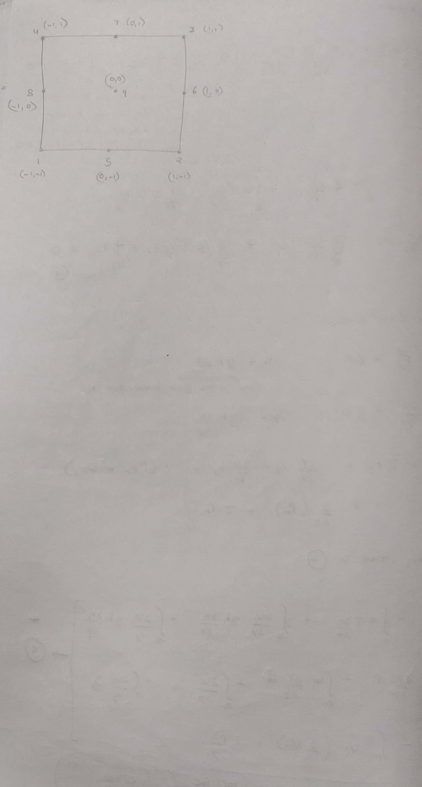 |
|  |
| 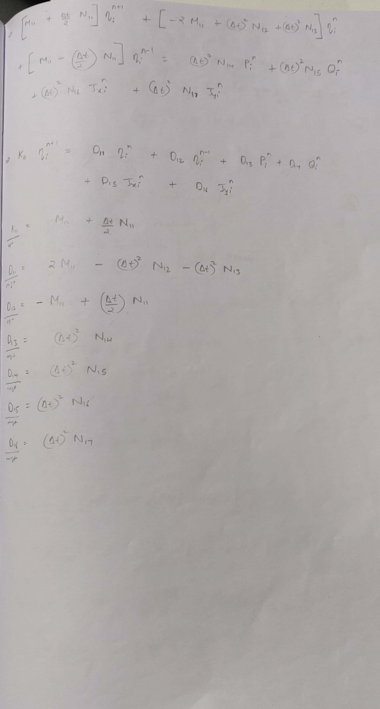 |
| 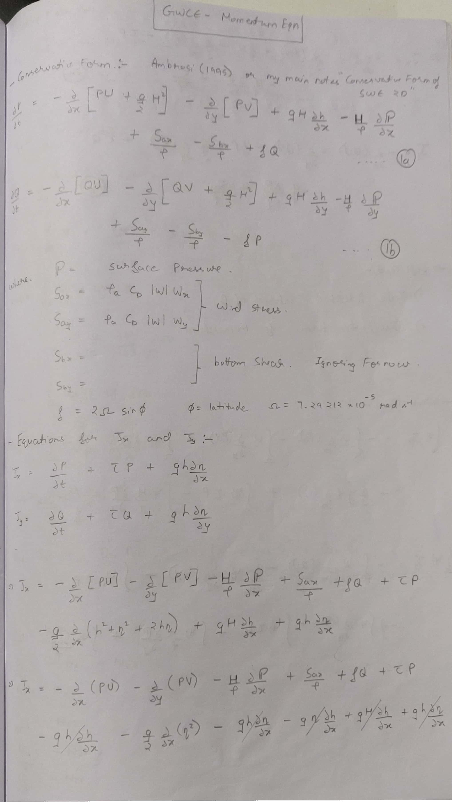 |
| 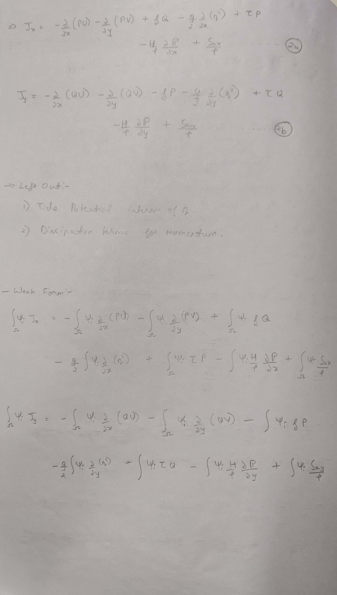 |
| 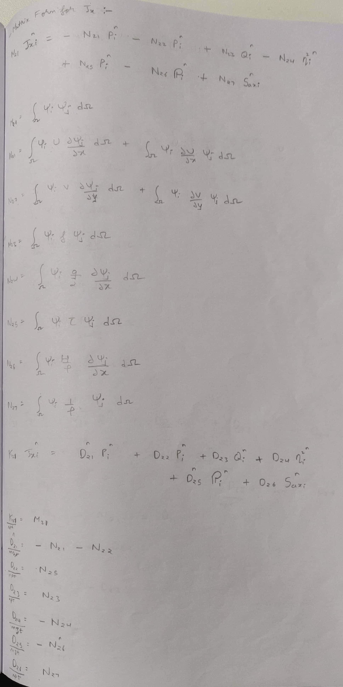 |
| 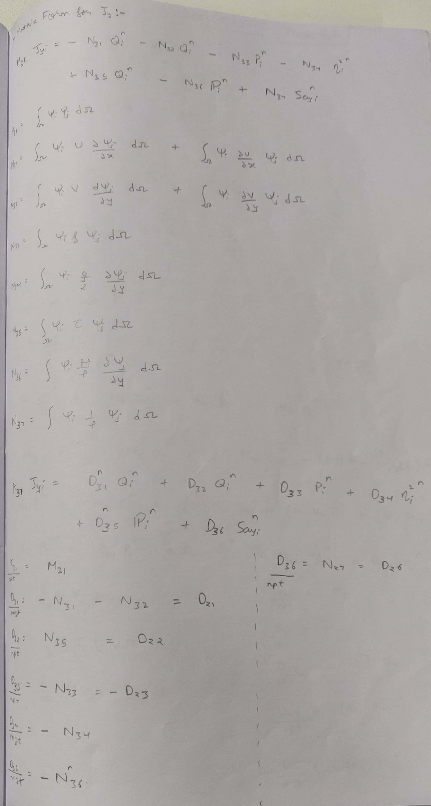 |
| 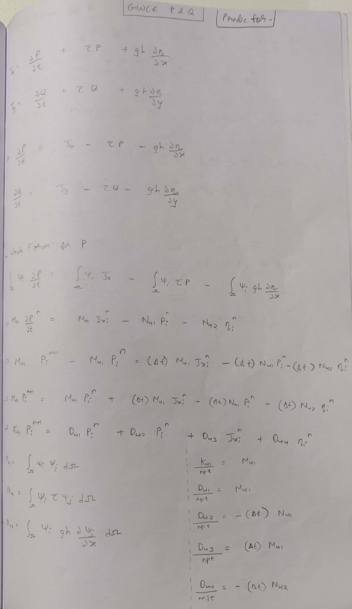 |
| 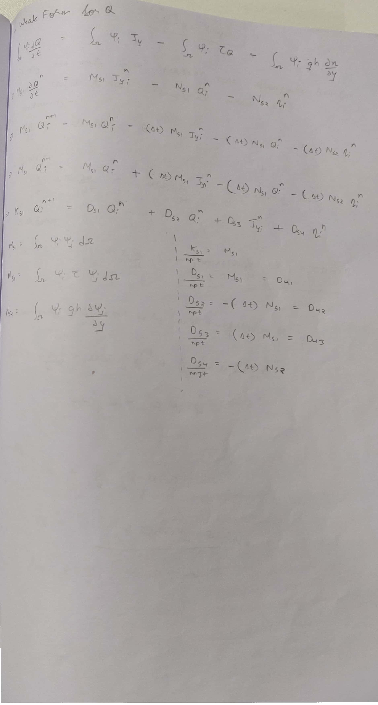 |
| 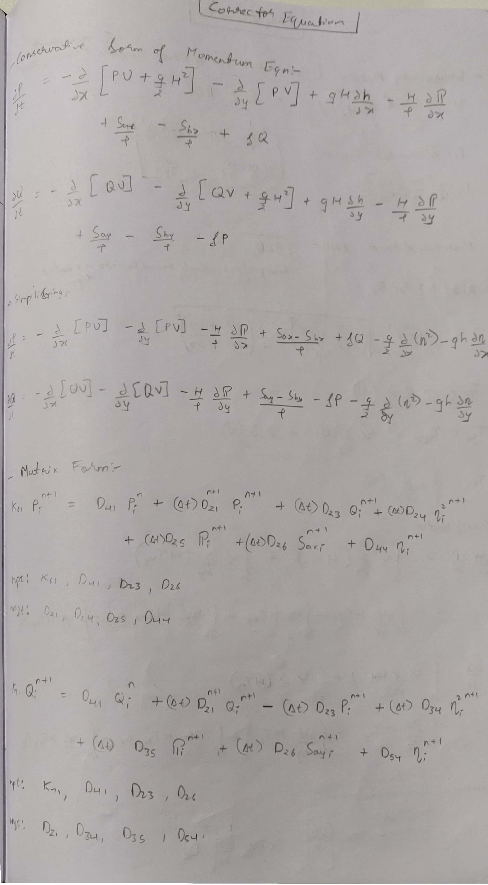 |
| 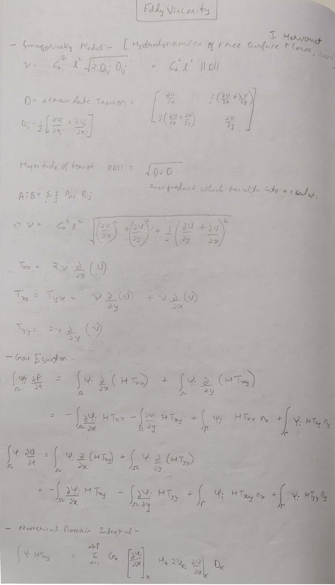 |

-----------------------------------------------

## References
1. Luettich, R., & Westerink, J. (2004). Formulation and Numerical Implementation of the 2D/3D ADCIRC Finite Element Model Version 44.XX.

1. Kolar, R., & Westerink, J. (2000). A look back at 20 years of GWC-based shallow water models. … on Computational Methods in Water …, 2(2). Retrieved from [Link](http://www.coe.ou.edu/emgis/kolar/resources/CMWRXIIIPaper1.pdf)

1. Dresback, K. M., Kolar, R. L., & Dietrich, J. C. (2004). A 2D implicit time-marching algorithm for shallow water models based on the generalized wave continuity equation. International Journal for Numerical Methods in Fluids, 45(3), 253–274. [Link](https://doi.org/10.1002/fld.697)

1. Luettich, R., Westerink, J., & Scheffner, N. W. (1992). ADCIRC : An advanced 3-D circulation model for shelves, coasts, and estuaries.

1. Dresback, K. M., & Kolar, R. L. (2002). An implicit time‐marching algorithm for shallow water models based on the generalized wave continuity equation. International Journal for Numerical Methods in Fluids, 36(8), 925–945. [Link](https://doi.org/10.1002/fld.157.abs)

1. Carter, G. S., & Merrifield, M. A. (2007). Open boundary conditions for regional tidal simulations. Ocean Modelling, 18(3–4), 194–209. [Link](https://doi.org/10.1016/j.ocemod.2007.04.003)
